# Часть 1

## Шаг 1: Построение сети
Строим топологию сети

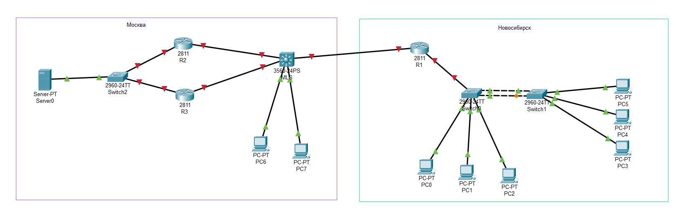

*Топология сети, построенная в Cisco Packet Tracer.*

---

## Шаг 2: Настройка Сообщения Дня (MOTD) на роутерах
Настройка `banner motd` на роутерах. Сообщение содержит ФИО, группу и номер по журналу.

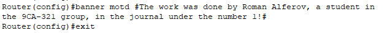

*Ввод команды `banner motd` на роутерах rus-nsk-r1, rus-msk-r2, rus-msk-r3.*

---

## Шаг 3: Переименование устройств
Настройка имени на R1.

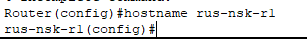

*Настройка имени хоста `rus-nsk-r1` на роутере R1.*

Настройка имени на SW0.

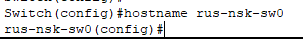

*Настройка имени хоста `rus-nsk-sw0` на коммутаторе SW0.*

Настройка имени на SW1.

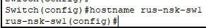

*Настройка имени хоста `rus-nsk-sw1` на коммутаторе SW1.*

Настройка имени на R2.

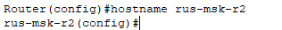

*Настройка имени хоста `rus-msk-r2` на роутере R2.*

Настройка имени на R3.

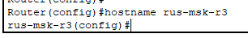

*Настройка имени хоста `rus-msk-r3` на роутере R3.*

Настройка имени на SW2.

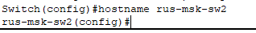

*Настройка имени хоста `rus-msk-sw2` на коммутаторе SW2.*

Настройка имени на Multilayer Switching.

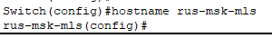

*Настройка имени хоста `rus-msk-mls` на Multilayer Switching.*

---

## Шаг 4: Настройка доменного имени согласно расположению
Установка доменного имени `nsk.local` на всех устройствах Новосибирска.

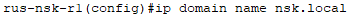

*Настройка доменного имени на `rus-nsk-r1`*

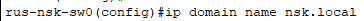

*Настройка доменного имени на `rus-nsk-sw0`*

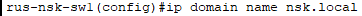

*Настройка доменного имени на `rus-nsk-sw1`*

Установка доменного имени `msk.local` на всех устройствах Москвы.

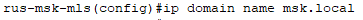

*Настройка доменного имени на `rus-msk-mls`*

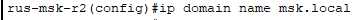

*Настройка доменного имени на `rus-msk-r2`*

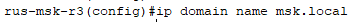

*Настройка доменного имени на `rus-msk-r3`*

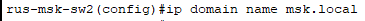

*Настройка доменного имени на `rus-msk-sw2`*

---

## Шаг 5: Создание VLAN на уоммутаторах Новосибирска
Создание VLAN 2, 3, 4 на коммутаторе sw0.

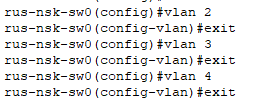

*Создание VLAN на sw0.*

Создание VLAN 2, 3, 4 на коммутаторе sw1.

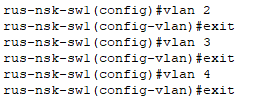

*Создание VLAN на sw1.*

---

## Шаг 6: Назначение VLAN для интерфейсов коммутаторов
Настройка интерфейсов f0/2, f0/3, f0/4 в режим доступа и назначение их в соответствующие VLAN на sw0.

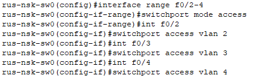

*Настройка f0/2-4 на sw0*

Настройка интерфейсов f0/2, f0/3, f0/4 в режим доступа и назначение их в соответствующие VLAN на sw1.

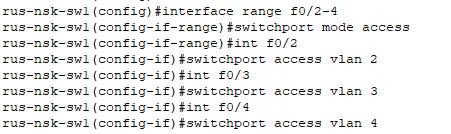

*Настройка f0/2-4 на sw1*

---

## Шаг 7: Настройка EtherChannel
Настройка Port-channel 1 на интерфейсах G0/1-2. Назначение режима транка на sw0.

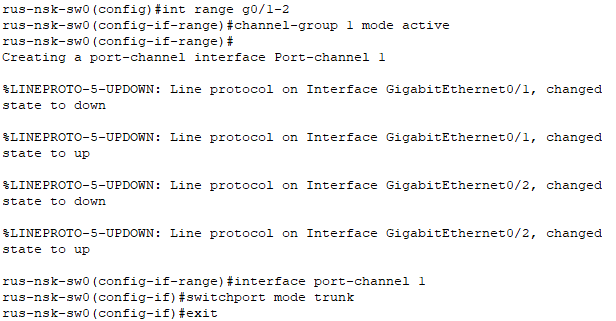

*Настройка g0/1-2 на sw0*

Настройка Port-channel 1 на интерфейсах G0/1-2. Назначение режима транка на sw1.

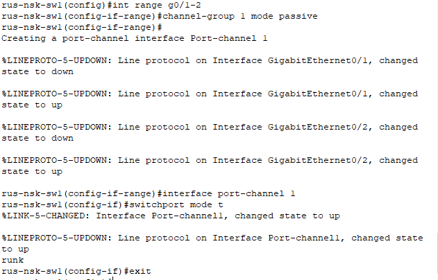

*Настройка g0/1-2 на sw1*

---

## Шаг 8: Создание Management Interface на SW0
Настройка SVI для VLAN 1 с IP-адресом 1.0.0.50/8 и шлюзом 1.0.0.1.

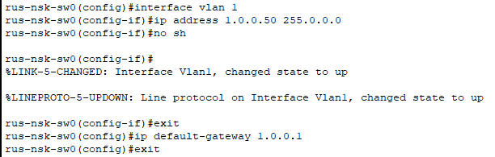

*Настройка SVI на sw0*

---

## Шаг 9: Management Interface на SW1
Настройка SVI для VLAN 2 с IP-адресом 2.0.0.50/8 и шлюзом 2.0.0.1.

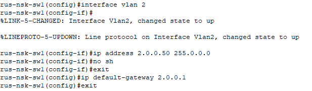

*Настройка SVI на sw1*

---

## Шаг 10: Настройка SSHv2
Включение SSH v2, создание локального пользователя `nsk` с паролем `cisco` и настройка на транспорт SSH на sw0.

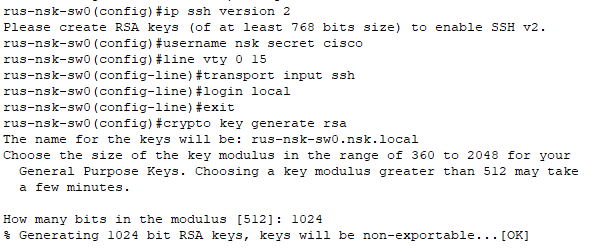

*Активация SSH v2 на sw0*

Включение SSH v2, создание локального пользователя `nsk` с паролем `cisco` и настройка на транспорт SSH на sw1.

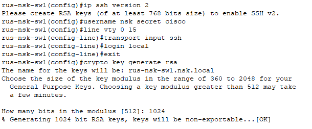

*Активация SSH v2 на sw1*

---

## Шаг 11: Настройка транка на f0/24
Настройка порта f0/24 в режим транка.

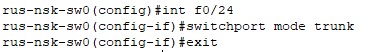

*Настройка f0/24 на sw0*

---

## Шаг 12: Настройка MOTD для коммутаторов sw0 и sw1
Установка баннера «Это rus-nsk-sw0!» для отображения при подключении.

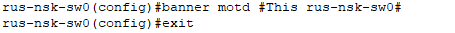

*Настройка баннера на sw0*

Установка баннера «Это rus-nsk-sw1!» для отображения при подключении.

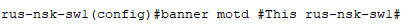

*Настройка баннера на sw1*

---

## Шаг 13: Настройка PortFast, BPDUguard и Port-Security на коммутаторах sw0 и sw1
Применение команд `spanning-tree portfast`, `bpduguard`, отключение CDP и настройка port-security на портах доступа f0/2-4 на sw0.

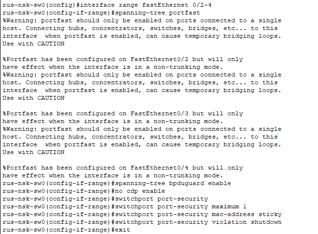

*Настройка на sw0*

Применение команд `spanning-tree portfast`, `bpduguard`, отключение CDP и настройка port-security на портах доступа f0/2-4 на sw1.

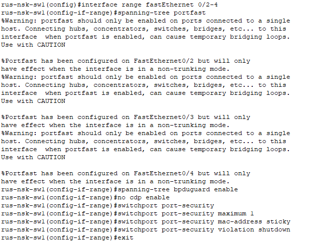

*Настройка на sw1*

---

## Шаг 14: Защита консольного подключения
Настройка консольной линии на использование пользователей настроенных на шаге 10 на sw0.

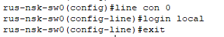

*Настройка на sw0*

Настройка консольной линии на использование пользователей настроенных на шаге 10 на sw1.

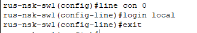

*Настройка на sw1*

---

## Шаг 15: Отключение таймаута сессии для консоли и ssh
Установка `exec-timeout 0 0` для консольной и VTY линий на sw0.

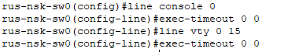

*Настройка exec-timeout на sw0*

Установка `exec-timeout 0 0` для консольной и VTY линий на sw1.

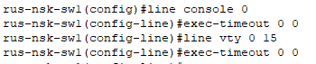

*Настройка exec-timeout на sw1*

---

## Шаг 16: Синхронизация логов
Включение `logging synchronous` для предотвращения прерывания ввода команд консольными сообщениями на sw0.

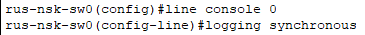

*Активация logging synchronous на sw0*

Включение `logging synchronous` для предотвращения прерывания ввода команд консольными сообщениями на sw1.

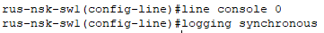

*Активация logging synchronous на sw1*

---

## Шаг 17: Изменение буфера истории
Установка размера буфера истории команд на 256 строк для консольной линии на sw0.

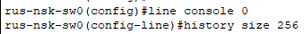

*Насройка буфера на sw0*

Установка размера буфера истории команд на 256 строк для консольной линии на sw1.

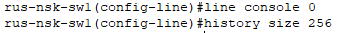

*Насройка буфера на sw1*

---
