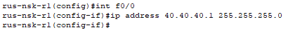
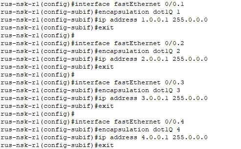
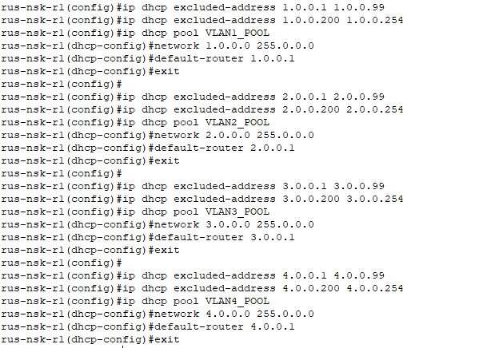
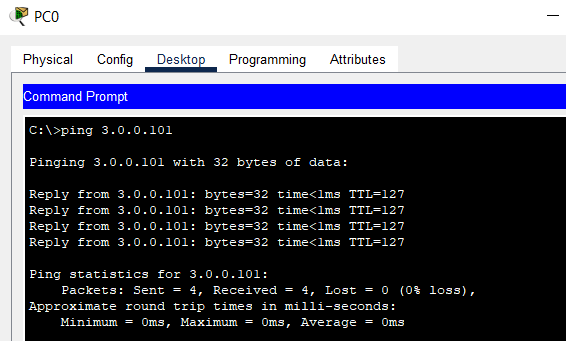

# Часть 2

## Шаг 1: Настройка интерфейса f0/1 на R1
*Назначение IP-адреса 40.40.40.1/24 на интерфейсе FastEthernet 0/1 маршрутизатора R1.*

---

## Шаг 2: Настройка маршрутизации между VLAN 1, 2, 3, 4
*Создание саб-интерфейсов на FastEthernet 0/0 с инкапсуляцией dot1Q для VLAN 1, 2, 3, 4 и назначение IP-адресов 1.0.0.1, 2.0.0.1, 3.0.0.1, 4.0.0.1 в качестве шлюзов по умолчанию.*

---

## Шаг 3: Настройка DHCP-сервера
*Исключение адресов из пула DHCP для VLAN 1, 2, 3, 4; указание сети и основного шлюза.*

*Проверка пинга с PC0 на 3.0.0.101.*

---
