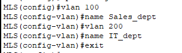
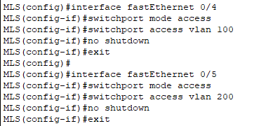
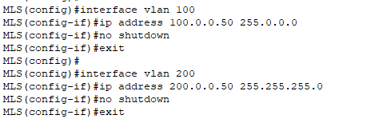
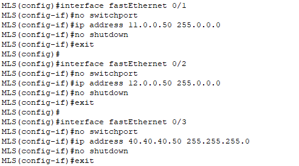
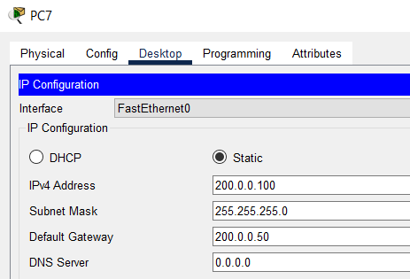

# Часть 3

## Шаг 1: Настройка имени хоста
Установка имени хоста `MLS` на многоуровневом коммутаторе.

*Настройка имени на многоуровневом коммутаторе*

---

## Шаг 2: Включение маршрутизации
Активация IP-маршрутизации командой `ip routing`.

*Включение маршрутизации на MLS*

---

## Шаг 3: Создание VLAN
Создание VLAN 100 с именем Sales_dept и VLAN 200 с именем IT_dept

*Настройка VLAN на MLS*

---

## Шаг 4: Назначение портов в VLAN
Настройка интерфейса f0/4 в VLAN 100 и f0/5 в VLAN 200.

*Настройка интерфейсов f0/4-5 на MLS*

---

## Шаг 5: Настройка SVI между VLAN 100 и 200
Настройка интерфейса VLAN 100 с IP-адресом 100.0.0.50/8 и VLAN 200 с IP-адресом 200.0.0.50/24.

*Настройка VLAN интерфейсов*

---

## Шаг 6: Настройка маршрутизируемых портов
Преобразование портов f0/1, f0/2, f0/3 в интерфейсы 3-го уровня с IP-адресами 11.0.0.50/8, 12.0.0.50/8, 40.40.40.50/24

*Настройка портов f0/1-3 на MLS*

---

## Шаг 7: Проверка связности
Наcтраиваем IP-адрес PC6.

*Настройка IP адреса на PC6*

Настраиваем IP-адрес PC7.

*Настройка IP адреса на PC7*

Выполняем пинг с PC6 на 200.0.0.100

*Выполнение пинга*

---
