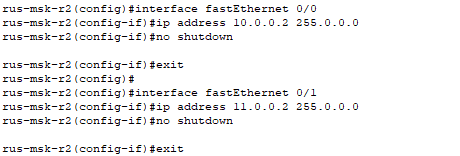
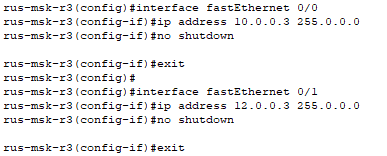
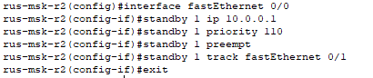
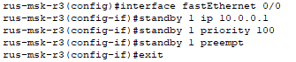

# Часть 4

## Шаг 1: Настройка IP-адресов на R2
*Настройка интерфейса f0/0 с IP-адресом 10.0.0.2/8 и f0/1 с IP-адресом 11.0.0.2/8.*

---

## Шаг 2: Настройка IP-адресов на R3
*Настройка интерфейса f0/0 с IP-адресом 10.0.0.3/8 и f0/1 с IP-адресом 12.0.0.3/8.*

---

## Шаг 3: Настройка Cisco High availability
*Настройка Cisco High availability на R2.*

*Настройка Cisco High availability на R3.*

---
