# Часть 6

## Шаг 1: Настройка ACL sw2 для приема SSH-соединений.
*Создание ACL на sw2, для приема SSH-соединений только с 10.0.0.100 и 2.0.0.100.*

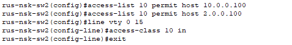

*Проверка ACL с Server0.*

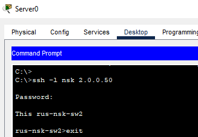

*Проверка ACL с PC3.*

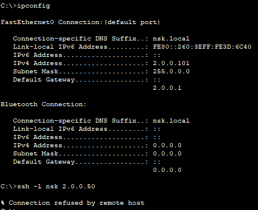

---

## Шаг 2: Ограничение доступа к веб-серверу
*Создание расширенного ACL на R2 и применение его на f0/1 в направлении in.*

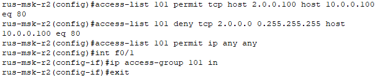

*Создание расширенного ACL на R3 и применение его на f0/1 в направлении in.*

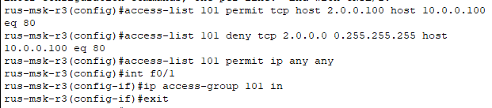

*Проверка ACL.*

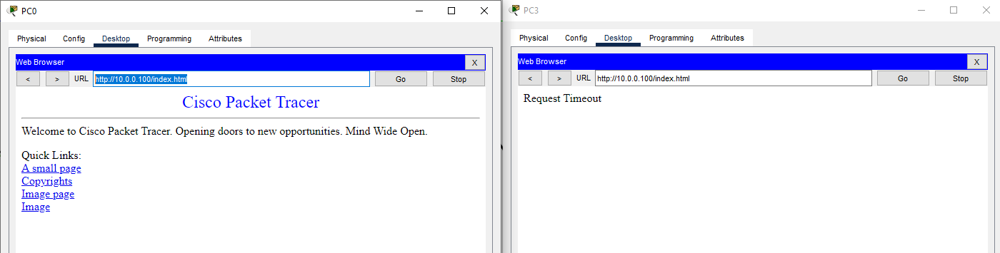

---

## Шаг 3: Запрет ответа на ping с R2 и R3
*Создание расширенного ACL на R2, запрещающего ICMP echo-repl и применение его на f0/1 в направлении in.*

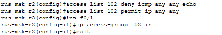

*Применение ACL на интерфейс f0/0 в направлении in.*

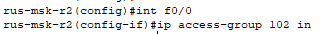

*Создание расширенного ACL на R3, запрещающего ICMP echo-reply и применение его на f0/1 в направлении in.*

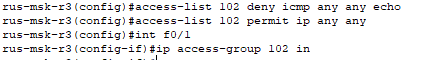

*Применение ACL на интерфейс f0/0 в направлении in.*

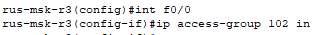

*Проверка: пинг R2 с ПК в Новосибирске.*

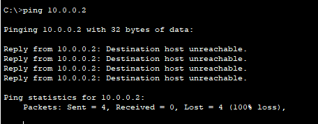

*Проверка: пинг ПК с R2.*

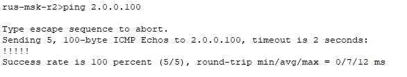

*Проверка: пинг сервера 10.0.0.100 с R2.*

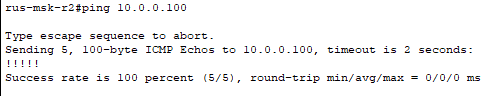

*Проверка: пинг коммутатора sw1 с R3.*

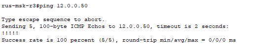

---
