# Часть 8

## Шаг 1: Настройка R1, R2, R3, MLS на использование Server0 в качестве NTP сервера и Syslog сервера
Включение NTP-сервиса на Server0.

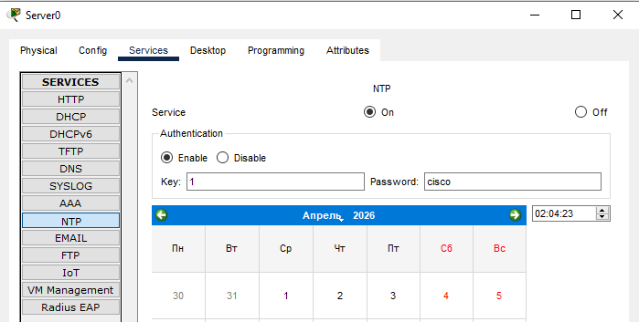

*Активация NTP*

Включение Syslog-сервиса на Server0.

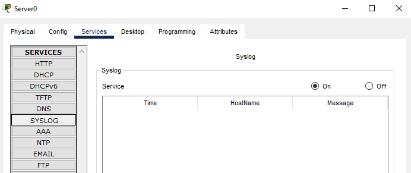

*Активация Syslog*

Добавление ключа аутентификации ID 1 с паролем cisco на R1.

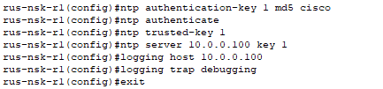

*Добавление ключа на R1*

Добавление ключа аутентификации ID 1 с паролем cisco на R2.

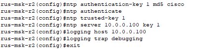

*Добавление ключа на R2*

Добавление ключа аутентификации ID 1 с паролем cisco на R3.

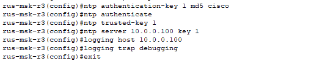

*Добавление ключа на R3*

Добавление ключа аутентификации ID 1 с паролем cisco на MLS.

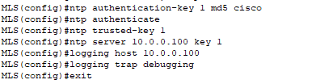

*Добавление ключа на MLS*

---

## Шаг 2: Настройка SNMP 
Настройка SNMP community `cisco` с правами чтения и записи на R2.

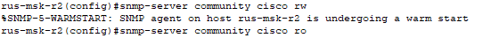

*Настройка SNMP на R2*

Настройка SNMP community `cisco` с правами чтения и записи на R3.

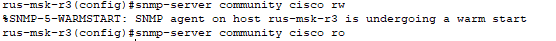

*Настройка SNMP на R3*

---

## Шаг 3: Настройка AAA (RADIUS) и проверка Telnet
Включение RADIUS-сервиса на Server0; Добавление клиента R3 с секретом cisco; Создание пользователя `radiususer` с паролем `radiuspass`.

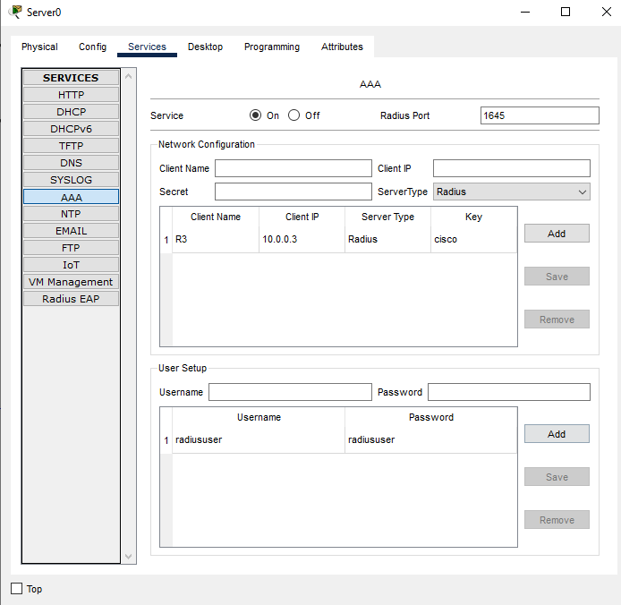

*Натсройка RADIUS на сервере*

Включение AAA на R3 командой `aaa new-model`; Настройка RADIUS-сервера 10.0.0.100; Настройка метода аутентификации: сначала RADIUS, затем локальная база; Настройка RADIUS-сервера 10.0.0.100; Создание резервного локального пользователя backup с паролем cisco; Включение telnet.

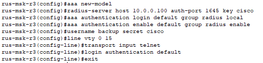

*Настройка AAA на R3*

Telnet-подключение к R3 с использованием RADIUS-учетных данных.

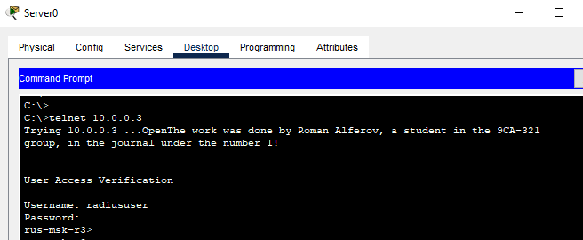

*Выполнение telnet подключения*

Отключаем AAA для проверки работоспособности локальной базы в случае недоступности Server0.

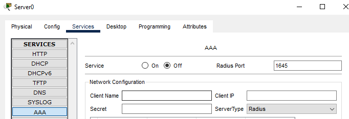

*Отключаем AAA на сервере*

Telnet-подключение к R3 с использованием локальной базы данных.

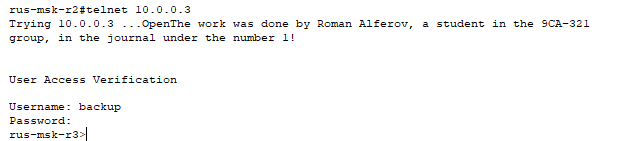

*Выполнение telnet подключения*

---

## Шаг 4: Настройка FTP
Включение FTP-сервиса на Server0; Создание пользователя cisco с паролем cisco.

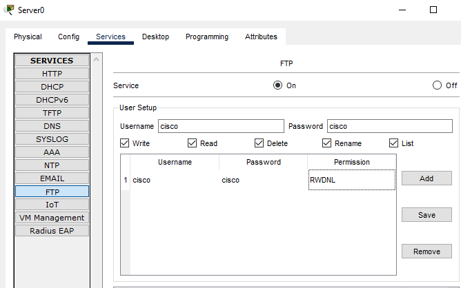

*Активация FTP*

Настройка учетных данных FTP на R2.

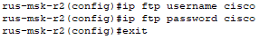

*Настройка данных FTP на R2*

---

## Шаг 5: Проверка FTP
Сохранение running-config c R2 на FTP-сервер.

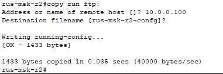

*Сохранение конфигурации*

Проверка наличия файла rus-msk-r2-config на FTP-сервере.

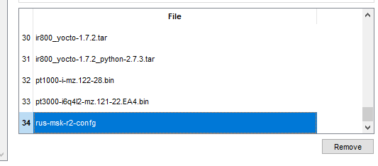

*Проверка сохранения файла*

---

## Шаг 6: Настройка TFTP и проверка
Включение TFTP-сервиса на Server0.

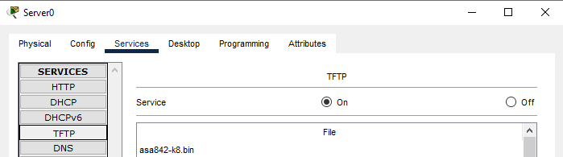

*Активация TFTP*

Сохранение running-config с R3 на TFTP-сервер.

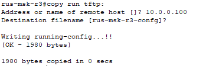

*Сохранение конфигурации*

Проверка наличия файла `rus-msk-r3-config` на TFTP-сервере.

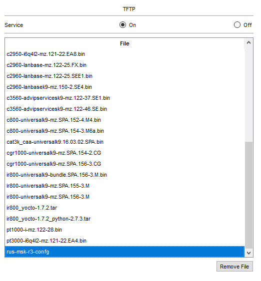

*Проверка сохранения файла*

---

## Шаг 7: Проверка отсутствия boot system
Проверка конфигурации R3 на наличие команд `boot system`.

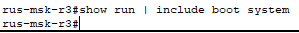

*Проверка конфигурации R3*

## Шаг 8: Проверка пинга и telnet используя имя standby
Натстройка DNS записи с именем standby и IP-дресом 10.0.0.3 на R2.

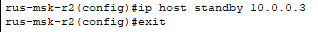

*Настройка записи DNS*

Проверка telnet используя имя standby.

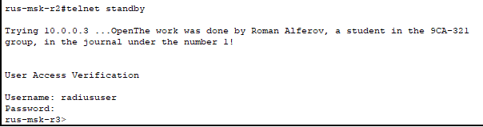

*Выполнение telnet*

## Шаг 9: Смена пользователя используя процедуру восстановления пароля
Перезагружаем R3 и во время загрузки нажимаем 'Ctrl+Break'; Изменяем конфигурационный регистр и повторно перезагружаем R3.

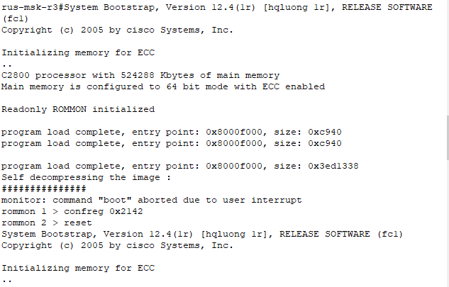

*Настройка конфигурационного регистра*

Входим в привилегированный режим.

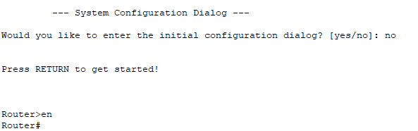

*Вход в привелигированный режим*

Копируем 'startup-config' в 'running-config'.

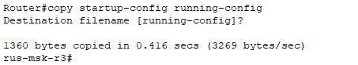

*Копирование конфигурации*

Создаем нового пользователя `new_user` с паролем `cisco`; Меняем регистр на изначальный; Копируем изменённый `running-config` в `startup-config` и перезагружаем R3.

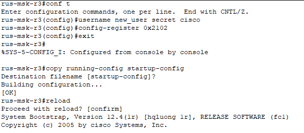

*Натсройка полбзователя и копирование конфигурации*

Выполняем вход под созданной учетной записью через CLI.

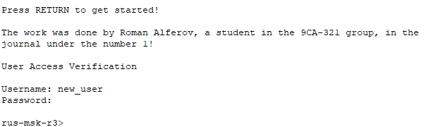

*Вход в учетную запись через CLI*

Выполняем вход под созданной учетной записью через telnet.

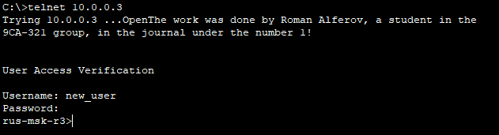

*Вход в учетную запись через telnet*

---
