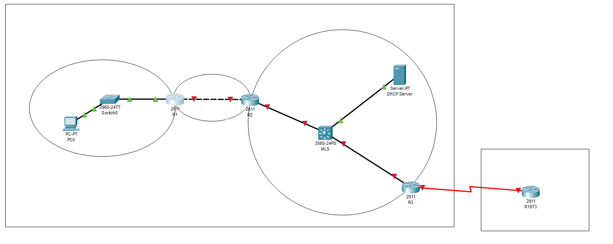
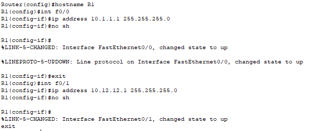
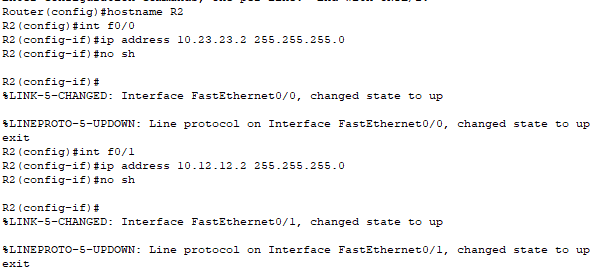
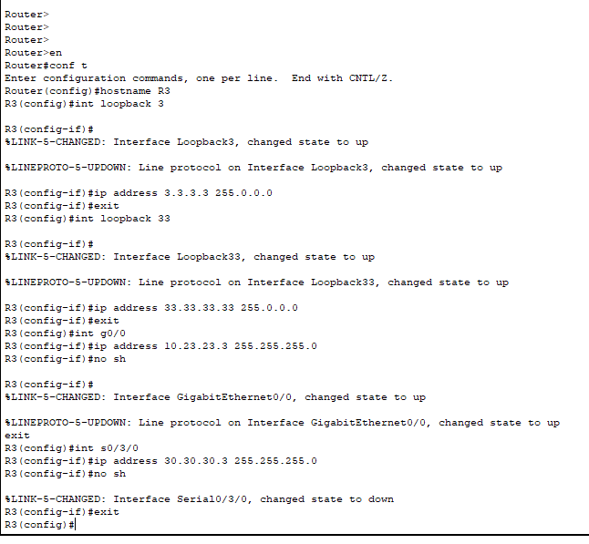
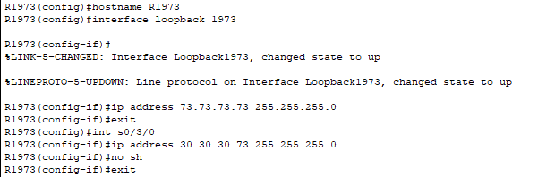

# Часть 1

## Шаг 1. Построение сети

Строим топологию сети.

*Топология сети, построенная в Cisco Packet Tracer.*

---

## Шаг 2. Настройка R1

Настройка имени хоста и интерфейсов Fa0/0 и Fa0/1.

*Настройка R1*

---

## Шаг 3. Настройка R2

Настройка имени хоста и интерфейсов Fa0/0 и Fa0/1.

*Настройка R2*

---

## Шаг 4. Настройка R3

Настройка имени хоста, Loopback 3, Loopback 33, Gig0/0 и Se0/3/0.

*Настройка R3*

---

## Шаг 5. Настройка R1973

Настройка имени хоста, Loopback 1973 и Se0/3/0.

*Настройка R1973*

---
