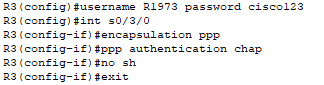
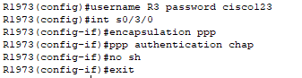

## Часть 2

### Шаг 1. Настройка последовательного интерфейса между R3 и R1973

Настройка протокола инкапсуляции PPP с двусторонней аутентификацией CHAP на R3 Имя пользователя совпадает с hostname соседнего маршрутизатора. Пароль: `cisco123`.

Настройка протокола инкапсуляции PPP с двусторонней аутентификацией CHAP на R1973 Имя пользователя совпадает с hostname соседнего маршрутизатора. Пароль: `cisco123`.

---