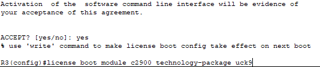
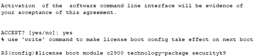
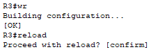

# Часть 5. Установка лицензий на R3

## Шаг 1. Активация лицензий UCK9 и Security9

Выполнение установки лицензии UCK9

*Установка лицензии*

Выполнение установки лицензии securityk9

*Установка лицензии*

Сохранение конфигурации и перезагрузка маршрутизатора

*Сохранение конфигурации и перезагрузка*

---
