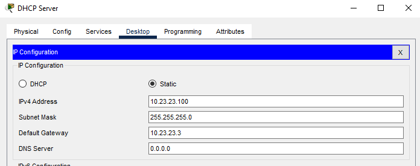
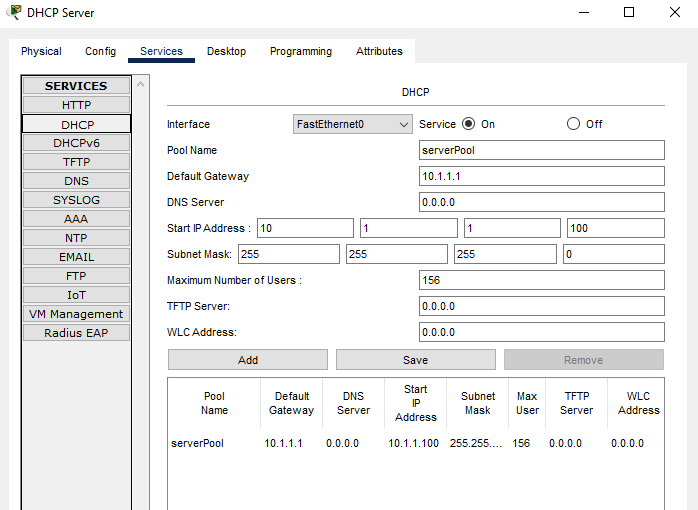
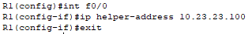
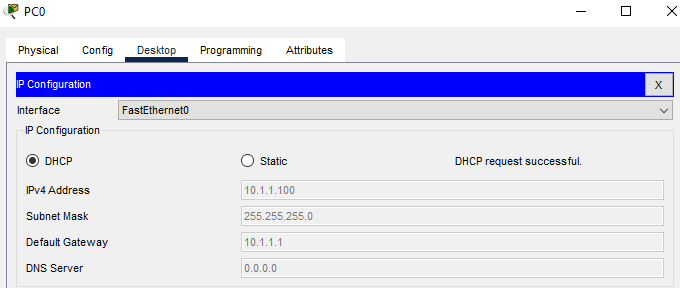

# Часть 6. Настройка DHCP Relay

## Шаг 1. Настройка статического IP-адреса DHCP серверу

*Настройка статического IP*

## Шаг 2. Настройка DHCP-пула на сервере

*Настройка DHCP сервера*

## Шаг 3. Настройка DHCP relay на R1

*Настройка DHCP relay*

## Шаг 4. Проверка получения IP-адреса по DHCP 

*Проверка работоспособности DHCP*

---
