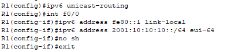
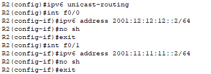
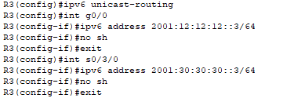
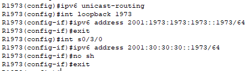

# Часть 7

## Шаг 1. Настройка IPv6 адресов маршрутизаторам

Настраиваем IPv6 на R1

*Настройка IPv6 на R1*

Настраиваем IPv6 на R2

*Настройка IPv6 на R2*

Настраиваем IPv6 на R3

*Настройка IPv6 на R3*

Настраиваем IPv6 на R1973

*Настройка IPv6 на R1973*

---
