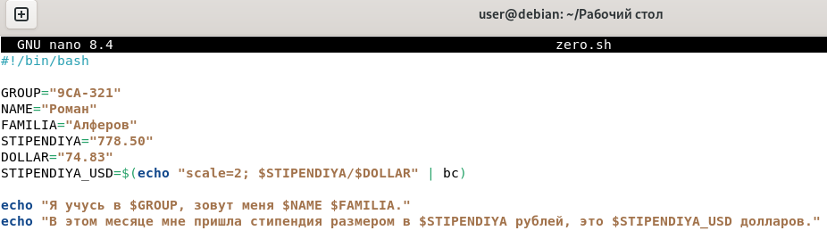
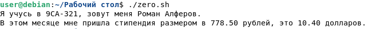

# [zero.sh](codes/zero.sh)

## Создаём файл командой `touch`
 

## Делаем файл исполняемым командой `chmod +x`
 

## Открываем редактор командой `nano`
 

## Заполняем файл кодом

## Выполняем проверку командой `./zero.sh`

---
