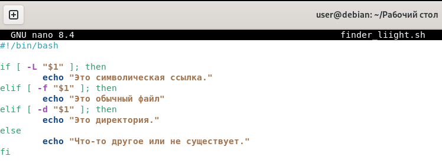
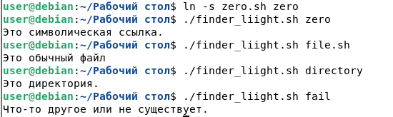

#finder_liight.sh

##Создаём файл командой 'touch'
 

##Делаем файл исполняемым командой 'chmod +x'
 

##Открываем редактор командой 'nano'
 

##Заполняем файл кодом

##Выполняем проверку командой './finder_liight.sh'

