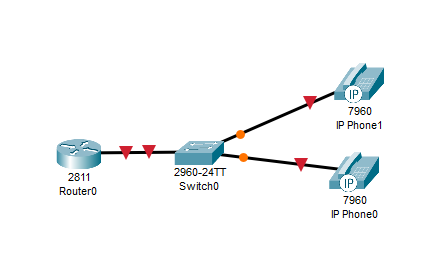
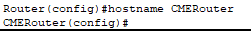
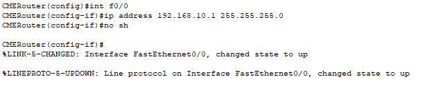
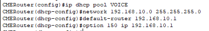
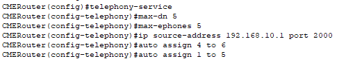
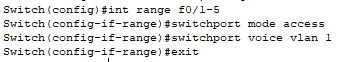
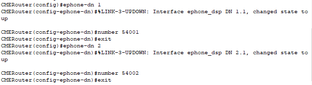

# 1. Базовая настройка ip-телефонов в среде cisco packet tracer

Строим топологию сети

*топология сети построенная в cisco packet tracer*

Изменяем имя маршрутизатора

*Смена имени на маршрутизаторе*

Отключаем синтаксис ввода слов от DNS серверов

*Отключение domain-lookup*

Настраиваем интерфейс f0/0 на маршрутизаторе CMERouter

*настройка f0/0 на маршрутизаторе*

Настраиваем пул DHCP адресов

*Натсройка DHCP*

Настраиваем CallManager Express

*Настройка CME*

Настраиваем VLAN на интерефйсах коммутатора

*Настройка VLAN на коммутаторе*

Создаем логическую линию и настраиваем номера телефонов

*Натсройка данных телефонов*

---

# Контрольные вопросы

1. Принцип работы протокола SIP?

SIP (Session Initiation Protocol) — протокол прикладного уровня, предназначенный для установления, управления и завершения сеансов связи между участниками. Он используется для голосовых и видеозвонков, видеоконференций, обмена мгновенными сообщениями и других видов мультимедийной коммуникации через IP-сети.

2. Как создается VLAN для голосового трафика?

interface FastEthernet0/1\
 switchport mode access\
 switchport voice vlan 1

3. Система Cisco Call Manager?

Cisco CallManager — это программно-аппаратный комплекс IP-АТС (автоматической телефонной станции), который предоставляет пакет услуг унифицированных коммуникаций. Система управляет голосовыми и видеосессиями, поддерживает обмен мгновенными сообщениями, организацию веб-конференций, голосовую связь через телефонные линии, IP-устройства, ПК, планшеты, смартфоны и другие интелектуальные устройства.

4. Система Cisco Call Manager Express?

Cisco Call Manager Express (CCME) — интегрированное решение для обработки и управления телефонными соединениями в системе Cisco IP-телефонии для малого офиса или автономного удалённого офиса компании.

5. Чем отличается система Cisco Call Manager от системы Cisco Call Manager Express?

CUCM работает на выделенном сервере, обслуживает до 40 000 телефонов, поддерживает кластер с полноценным резервированием, настраивается через веб-интерфейс. CME работает как служба на маршрутизаторе, тянет максимум 450 телефонов, резервирование только аварийное по SRST, настройка только через командную строку.

6. Что дает команда spanning-tree portfast?

Команда spanning-tree portfast переводит порт в режим, при котором он сразу переходит в состояние forwarding (передача данных), минуя стандартные фазы listening и learning протокола STP.

7. Требования к сети при передаче голосового трафика?

- Пропускная способность. На один разговор с кодеком G.711 нужно примерно 80–100 Кбит/с
- Задержка. Не выше 150 миллисекунд в одну сторону, иначе начинает проявляться эффект наложения речи, собеседники друг друга перебивают.
- Джиттер. Должен быть не больше 30 миллисекунд. Если пакеты приходят неравномерно, голос дрожит.
- Потери пакетов. Не более 1 процента. Выше этого порога начинаются пропадания слов и слогов, речь становится рваной.
- QoS. Голосовые пакеты должны обслуживаться с приоритетом.
- Разделение трафика. Голос и данные разносят по разным VLAN

8. Основные команды конфигурирования DHCP сервера на маршрутизаторе?

- ip dhcp excluded-address
- ip dhcp pool 
- network 
- default-router 
- option
