# 3. Конфигурация VoIP в среде cisco packet tracer

Строим топологию сети 

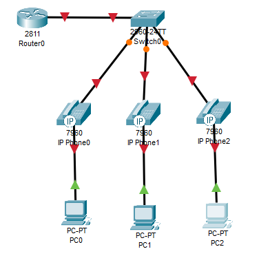

Создаем VLAN на коммутаторе и настраиваем их название 

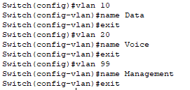

Настраиваем VLAN 99

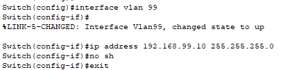

Задаём маршрут по умолчанию

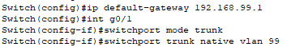

Настраиваем порты на коммутаторе

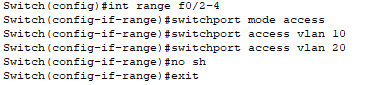

Включаем интерфейс f0/0

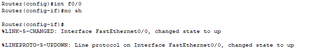

Создаем логические подинтерфейсы для VLAN

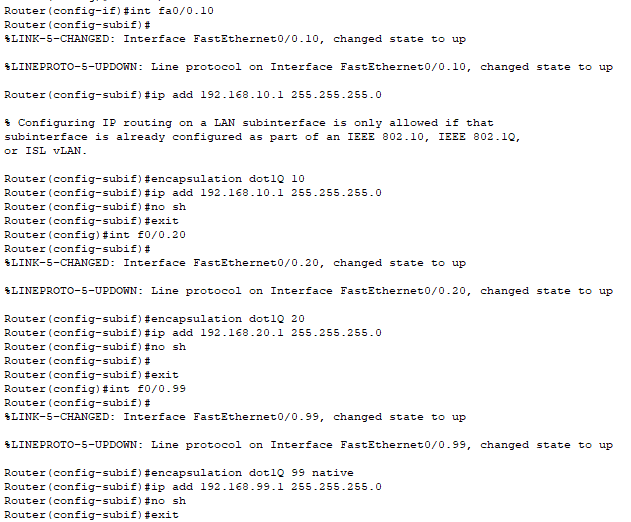

Исключаем из пула адресов адрес интерфейса маршрутизатора и DNS сервера

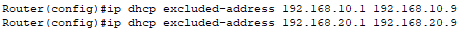

Настраиваем DHCP сервер

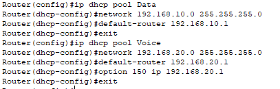

Настраиваем телефонный сервис

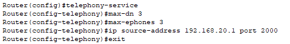

Присваиваем номера для телефонов

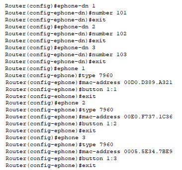

# Контрольные вопросы

1. Что такое SIP-телефоны?

SIP-телефон — это аппаратный или программный телефон для звонков через интернет, использующий протокол SIP для установки соединения. Голос передаётся не по телефонной линии, а пакетами по IP-сети. Бывают настольные аппараты, софтфоны на ПК и смартфоне, а также конференц-устройства.

2. Что такое Voice over IP?

VoIP — это технология передачи голоса через интернет или любую IP-сеть. Голос превращается в цифровые пакеты и идёт по сети вместе с обычными данными. Не нужна отдельная телефонная линия. Звонки между удалёнными офисами бесплатны, так как идут через уже существующий интернет-канал.

3. VOIP – определение.

VoIP (Voice over IP) — это технология, преобразующая аналоговый голосовой сигнал в цифровые пакеты данных и передающая их по IP-сети, заменяя традиционные телефонные линии.

4. Где можно найти хороший источник информации о VOIP?

Cisco Networking Academy (NetAcad), документация Cisco по настройке функций телефонии (CME — Call Manager Express).

5. Что такое IP-телефон / IP телефоны?

IP-телефон — это телефон, который подключается не к обычной телефонной розетке, а в LAN-порт компьютерной сети (Ethernet или Wi-Fi). Голос в нём сразу преобразуется в IP-пакеты и передаётся по сети. Внешне может выглядеть как обычный офисный аппарат, но внутри — фактически специализированный компьютер с сетевой картой, процессором, памятью и операционной системой.

6. Что такое IP-телефония?

IP-телефония — это технология телефонной связи, при которой голос передаётся по IP-сетям (интернету или локальной сети предприятия) вместо традиционных телефонных линий.

7. Что такое VoIP-телефон?

VoIP-телефон — это телефонный аппарат, который передаёт голос по IP-сети, а не по аналоговой телефонной линии. В нём голос оцифровывается, сжимается и отправляется пакетами данных в сеть.

8. Каким образом создается маршрут по умолчанию?

ip route 0.0.0.0 0.0.0.0 [адрес следующего узла]
