# [4. Построение сети ip телефонии между удаленными маршрутизаторами в среде cisco packet tracer](pkt/7.pkt)

## Шаг 1. Строим топологию сети

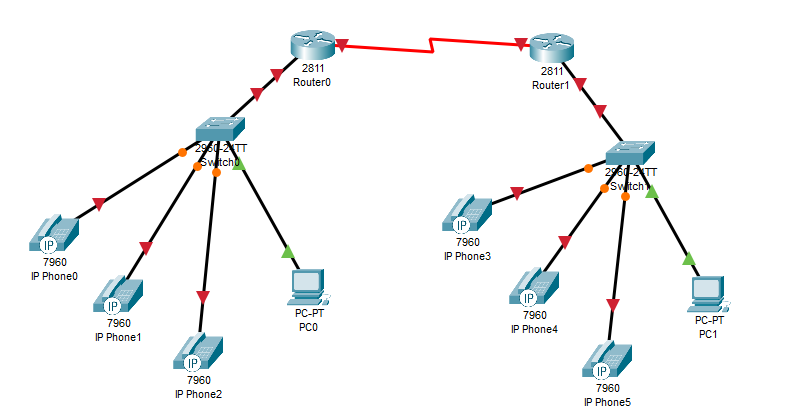

*Топология сети построенная в cisco packet tracer*

---

## Шаг 2. Изменяем имя маршрутизиаторов

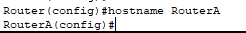

*Настройка имени RouterA*

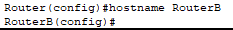

*Настройка имени RouterB*

---

## Шаг 3. Настраиваем интерфейс f0/0 на маршрутизаторах

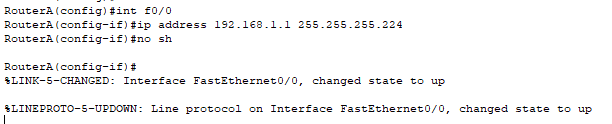

*Настройка f0/0 на RouterA*

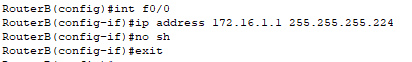

*Настройка f0/0 на RouterB*

---

## Шаг 4. Настройка Serial интерфейсов на маршрутизаторах

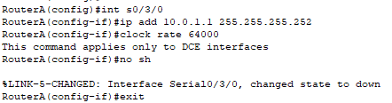

*Настройка s0/3/0 на RouterA*

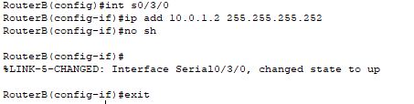

*Настройка s0/3/0 на RouterB*

---

## Шаг 5. Настройка DHCP пула на машрутизаторах

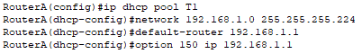

*Настройка DHCP на RouterA*

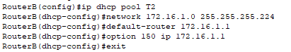

*Настройка DHCP на RouterB*

---

## Шаг 6. Настройка протокола RIPv2 на маршрутизаторах

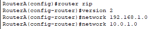

*Настройка RIPv2 на RouterA*

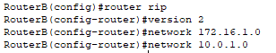

*Настройка RIPv2 на RouterB*

---

## Шаг 7. Настройка CallManager Express на маршрутизаторах

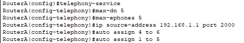

*Настройка CME на RouterA*

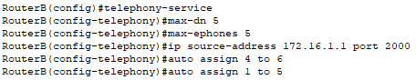

*Настройка CME на RouterB*

---

## Шаг 8. Изменяем имена коммутаторов

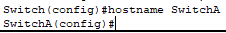

*Смена имени коммутатора на SwitchA*

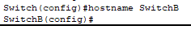

*Смена имени коммутатора на SwitchB*

---

## Шаг 8. Настраиваем порты на коммутаторе

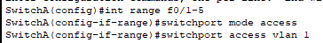

*Настройка портов на SwitchA*

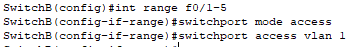

*Настройка портов на SwitchB*

--

## Шаг 9. Настраиваем логические линии связи и указываем номера для телефонов

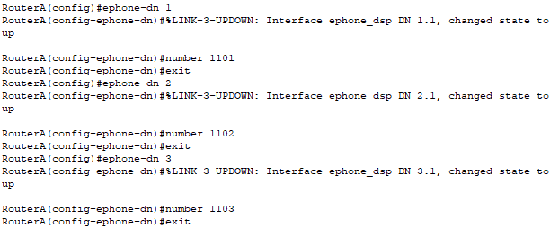

*Настройка данных телефонов на RouterA*

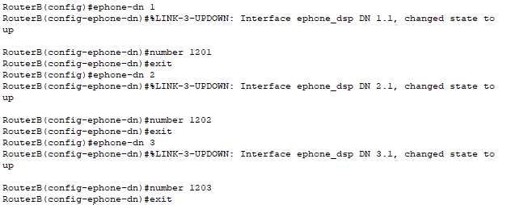

*Настройка данных телефонов на RouterB*

---

## Шаг 10. Настраиваем механизм для идентификации конечных точек вызова

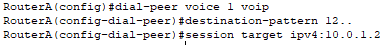

*Настройка dial-peer на RouterA*

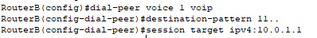

*Настройка dial-peer на RouterB*

--

## Шаг 11. Проверка пинга

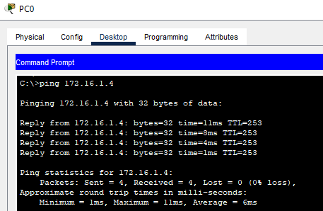

*Пинг на 172.16.1.4*

---

## Шаг 12. Проверка совершения вызова

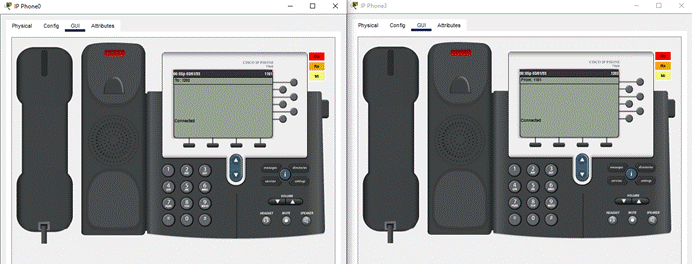

*Совершение вызова между телефонами в разных подсетях*

---

# Контрольные вопросы

1. Протоколы маршрутизаций и маршрутизируемые протоколы.

Маршрутизируемые протоколы — переносят данные пользователя, их можно передавать между сетями. Имеют адресацию. Пример: IP.
Протоколы маршрутизации — служебные, строят таблицы маршрутизации, не переносят пользовательские данные. Обмениваются информацией о сетях между маршрутизаторами. Пример: OSPF, EIGRP, RIP.

2. Протокол RIP. Механизмы предотвращения петель маршрутизации (poisoned reverse, split horizon, hop-count limit), сравнение RIP и IGRP.

RIP — простейший протокол маршрутизации, работает по принципу «число переходов». Ищет путь с наименьшим количеством маршрутизаторов до цели, максимум 15. Каждые 30 секунд рассылает соседям всю свою таблицу.
Для предотвращения петель маршрутизации используются следующие механизмы:
- Split Horizon: запрещает маршрутизатору отправлять информацию о маршруте через тот же интерфейс, от которого эта информация была получена.
- Poisoned Reverse: маршрутизатор помечает вышедший из строя маршрут как недостижимый и рассылает это обновление всем соседям.
- Hop-count limit: устанавливает максимальное расстояние до сети в 15 хопов; сеть на расстоянии 16 хопов считается недоступной, что разрывает бесконечные циклы.
В сравнении с IGRP, RIP ограничен 15 хопами и учитывает только расстояние, тогда как IGRP использует сложную метрику и поддерживает до 255 хопов.

3. Каким образом производится настройка DHCP-сервера на маршрутизаторе?

- ip dhcp excluded-address [start ip] [end ip].
- ip dhcp pool [name].
- network [network address] [mask].
- default-router [ip address].

4. Как работает последовательное соединение между маршрутизаторами?

Два роутера соединены напрямую патч-кордом. На соединяемых портах прописывают IP-адреса из одной подсети. После этого на каждом настраивают маршруты к сетям за соседним роутером. Пакет приходит на первый роутер, тот находит в таблице маршрут, отдаёт пакет в порт — второй роутер его забирает и везёт дальше.

5. Какие скорости доступны для последовательного соединения?

- T1 — 1.544 Мбит/с
- E1 — 2.048 Мбит/с
- T3 — 44.736 Мбит/с
- E3 — 34.368 Мбит/с
- Устаревшие синхронные — до 128 Кбит/с
- Современные — до 4 Мбит/с
- HSSI — до 52 Мбит/с
- Базовая единица — 64 Кбит/с

6. Минимальная необходимая скорость соединения для обеспечения качество обслуживания голосового трафика.

Минимальная скорость для одного VoIP-вызова зависит от кодека и составляет от 20 до 100 Кбит/с в обе стороны
- G.711: ~87–88 Кбит/с
- G.729: ~31–40 Кбит/с
- G.723.1: ~21 Кбит/с

7. Как можно выйти в сеть PSTN через IP телефон?

Выход с IP-телефона в обычную телефонную сеть (PSTN) происходит через специальный VoIP-шлюз или SIP-транк
Схема: IP-телефон → IP-сеть → VoIP-шлюз/SIP-транк провайдера → PSTN → Обычный телефон.

8. Какой командой можно присвоить номера телефонов телефонам?

- dn 1 
- number 1001

---