# [5. Построение сети ip телефонии между удаленными маршрутизаторами](pkt/8.pkt)

## Шаг 1. Строим топологию сети

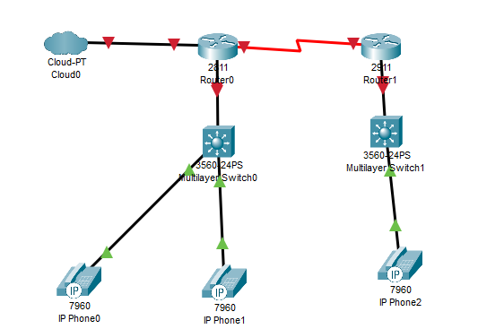

*Топология сети построенная в cisco packet tracer*

---

## Шаг 2. Настраиваем Serial интерфейс на маршрутизаторах

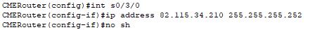

*Настройка s0/3/0 на CMERouter*

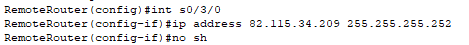

*Настройка s0/3/0 на RemoteRouter*

---

## Шаг 3. Настраиваем маршрутизацию по протоколу EIGRP на маршрутизаторе

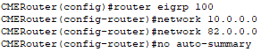

*Настройка EIGRP на CMERouter*

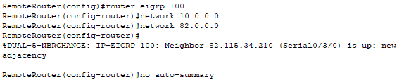

*Настройка EIGRP на RemoteRouter*

---

## Шаг 4. Выполняем проверку связи между маршрутизаторами

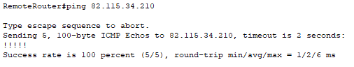

*Пинг serial интерфейса*

---

## Шаг 5. Создаем подинтерфейсы для VLAN и настраиваем их на RemoteRouter и CMERouter

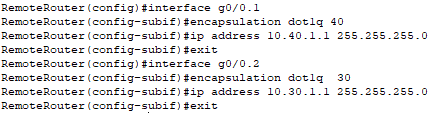

*Создание и настройка подинтерфейсов VLAN на RemoteRouter*

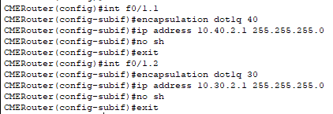

*Создание и настройка подинтерфейсов VLAN на CMERouter*

---

## Шаг 6. Настраиваем пароли для защиты коммутатора

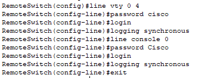

*Настройка защиты RemoteSwitch*

---

## Шаг 7. Настраиваем порт коммутаторов в транковый режим

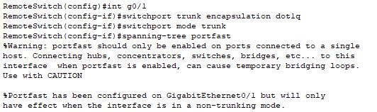

*Настройка порта на RemoteSwitch в режим trunk*

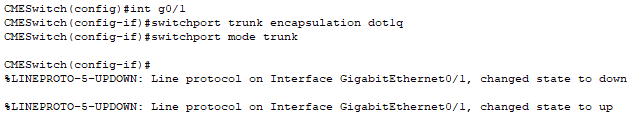

*Настройка порта на CMESwitch в режим trunk*

---

## Шаг 8. Настраиваем порты коммутаторов на access/voice vlan 

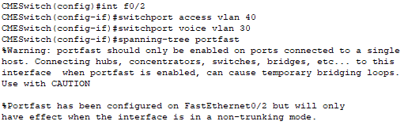

*Настройка порта f0/2 на CMESwitch*

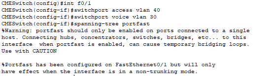

*Настройка порта f0/1 на CMESwitch*

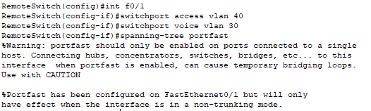

*Настройка порта f0/1 на RemoteSwitch*

---

## Шаг 9. Устанавливаем лицензию на RemoteRouter для работы с telephony-service

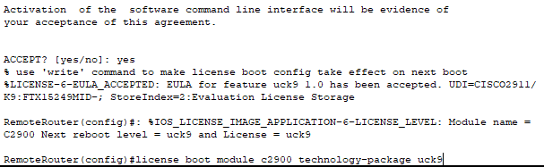

*Установки лицензии на RemoteRouter*

---

## Шаг 10. Настраиваем DHCP на маршрутизаторах

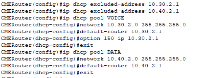

*Настройка DHCP на CMERouter*

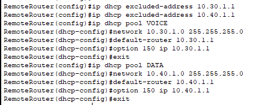

*Настройка DHCP на RemoteRouter*

---

## Шаг 11. Настраиваем telephony-service

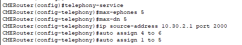

*Настройка telephony-service на CMERouter*

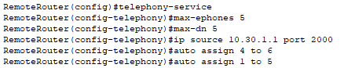

*Настройка telephony-service на RemoteRouter*

---

## Шаг 12. Настраиваем dial-peer

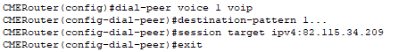

*Настройка dial-peer на CMERouter*

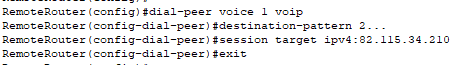

*Настройка dial-peer на RemoteRouter*

---

## Шаг 13. Настраиваем номера телефонов

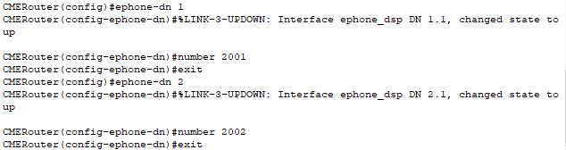

*Настройка телефонов на CMERouter*

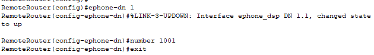

*Настройка телефона на RemoteRouter*

---

## Шаг 14. Проверка работоспособности

*Вызова с телефона 2002 на телефон 1001*

---

# Контрольные вопросы

1. Как работает последовательное соединение между маршрутизаторами?

Два роутера соединены напрямую патч-кордом. На соединяемых портах прописывают IP-адреса из одной подсети. После этого на каждом настраивают маршруты к сетям за соседним роутером. Пакет приходит на первый роутер, тот находит в таблице маршрут, отдаёт пакет в порт — второй роутер его забирает и везёт дальше.

2. Какие скорости доступны для последовательного соединения?

- T1 — 1.544 Мбит/с
- E1 — 2.048 Мбит/с
- T3 — 44.736 Мбит/с
- E3 — 34.368 Мбит/с
- Устаревшие синхронные — до 128 Кбит/с
- Современные — до 4 Мбит/с
- HSSI — до 52 Мбит/с
- Базовая единица — 64 Кбит/с

3. Минимальная необходимая скорость соединения для обеспечения качество обслуживания голосового трафика.

Минимальная скорость для одного VoIP-вызова зависит от кодека и составляет от 20 до 100 Кбит/с в обе стороны
- G.711: ~87–88 Кбит/с
- G.729: ~31–40 Кбит/с
- G.723.1: ~21 Кбит/с

4. Принцип работы протокола LDP.

LDP — протокол для автоматической раздачи меток MPLS. Работает в три этапа:
- Hello по UDP — находят соседей (мультикаст 224.0.0.2, порт 646).
- TCP-сессия — устанавливают надёжное соединение с соседом.
- Раздача меток — нижестоящий маршрутизатор сам присылает вышестоящему связку «метка — сеть» (FEC), без запроса. Метки вешаются на те же сети, что уже есть в таблице IP-маршрутизации.

5. Уровни архитектуры IP-телефонии.

- Уровень сетевой инфраструктуры
- Уровень управления вызовами
- Уровень приложений и услуг
- Уровень терминального оборудования

6. Как можно выйти в сеть PSTN через IP телефон?

Выход с IP-телефона в обычную телефонную сеть (PSTN) происходит через специальный VoIP-шлюз или SIP-транк
Схема: IP-телефон → IP-сеть → VoIP-шлюз/SIP-транк провайдера → PSTN → Обычный телефон.

7. Как работают сервисы IP телефонии перевод звонка, конференцсвязь?

Перевод звонка:
- Слепой перевод - вызывающий нажимает Transfer, набирает номер и завершает свой вызов; абоненты соединяются напрямую
- Консультируемый перевод — перед переводом вызывающий соединяется с целевым абонентом, убеждается, что тот готов принять вызов, затем переводит.
Конференц‑связь: один участник создаёт конференцию, приглашает остальных. Голос всех участников микшируется, и каждый слышит всех. В SIP это реализуется через B2BUA или MCU.

8. Как работают сервис IP телефонии - перехват звонка?

Перехват звонка (Call Pickup) — это функция, позволяющая ответить на вызов, который поступает на чужой телефонный аппарат. Сам механизм реализуется на стороне IP-АТС: когда система получает сигнал перехвата, она перенаправляет входящий вызов на аппарат того сотрудника, который этот перехват инициировал.
- Локальный перехват: пользователь нажимает кнопку Pickup или набирает код, и его телефон отвечает на звонок, поступивший на любой номер в группе.
- Перехват по группе - пользователь может указать номер группы, чтобы перехватить звонок, адресованный группе.

---
