# 1. Виртуальная машина и пользователи.

Скачиваем образ Ubuntu Server с официального сайта

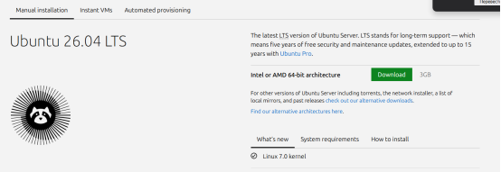

Открываем программу VMWare и запускаем мастер создания ВМ. Нажимаем далее

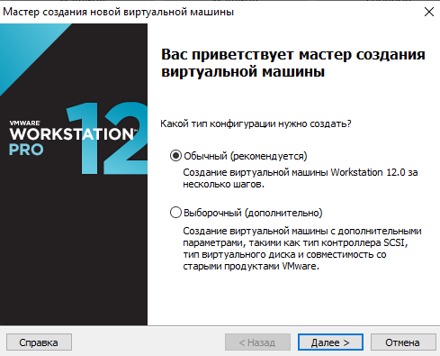

Выбираем скачаный образ Ubuntu Server

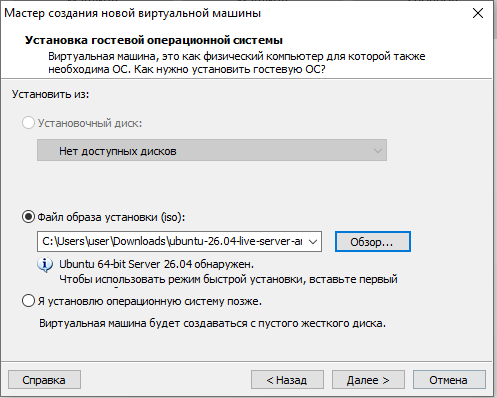

Указываем название виртуальной машины

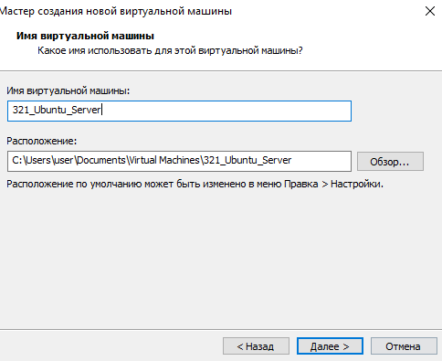

Указываем размер диска для ВМ

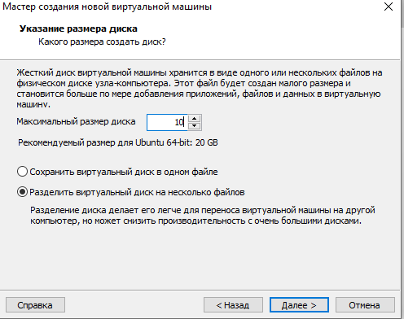

Проверяем настройки и нажимаем готово

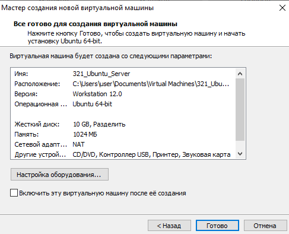

Переходим в настройки оборудования и изменяем размер ОЗУ и количество процессоров

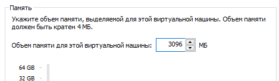

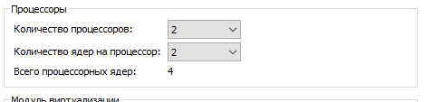

Запускаем машину и выбираем язык системы.

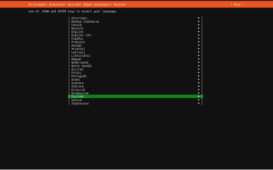

Выбираем раскладку клавиатуры

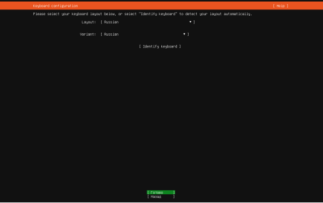

Выбираем метод смены раскладки клавиатуры

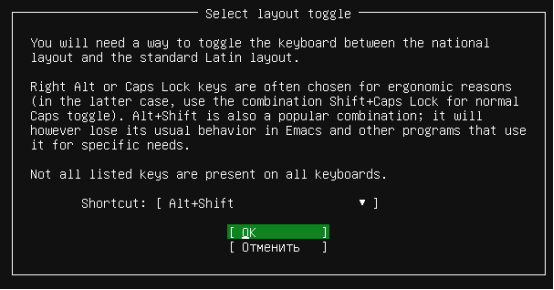

Выбираем тип установки

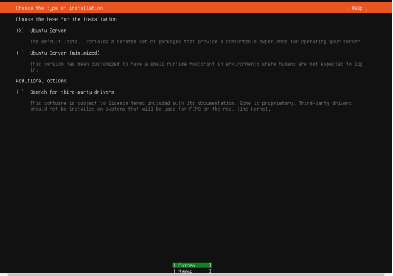

Проверяем конфигурацию сети 

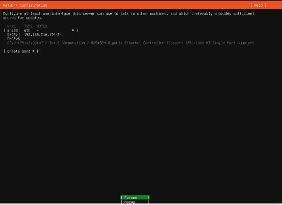

Пропускаем настройку прокси сервера

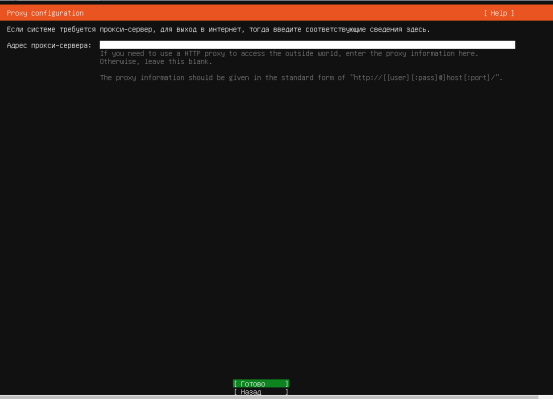

Указываем зеркало для установки

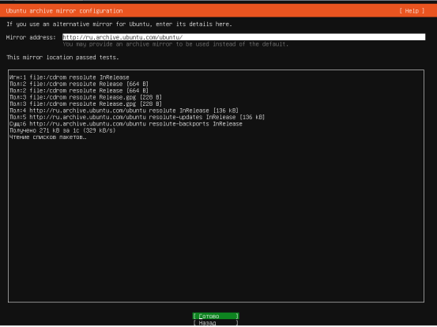

Выбираем диск куда будет установлена ос

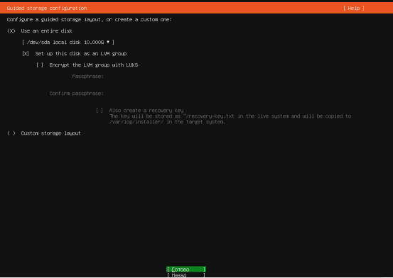

Проверяем настройки которые запишутся на диск

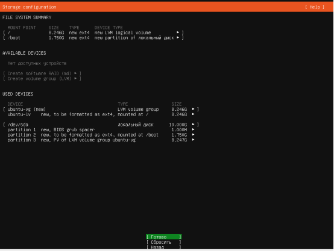

Подтверждаем запись изменений на диск

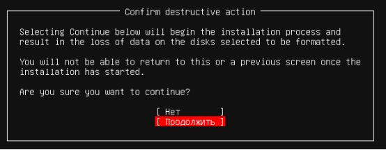

Настраиваем профиль пользователя и имя пк

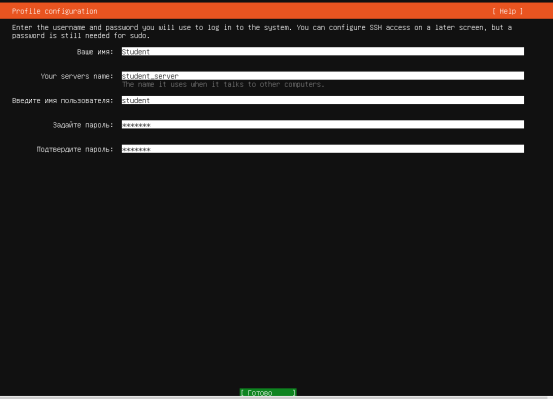

Пропускаем шаг с обновлением на Ubuntu Pro

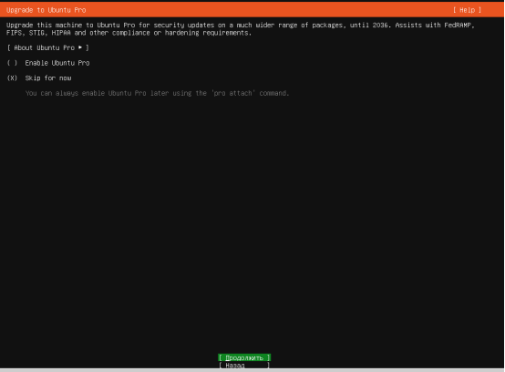

Пропускаем установку OpenSSH server

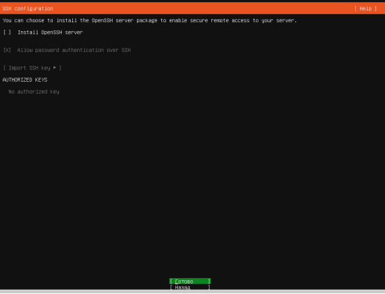

Пропускаем установку дополнительных компонентов

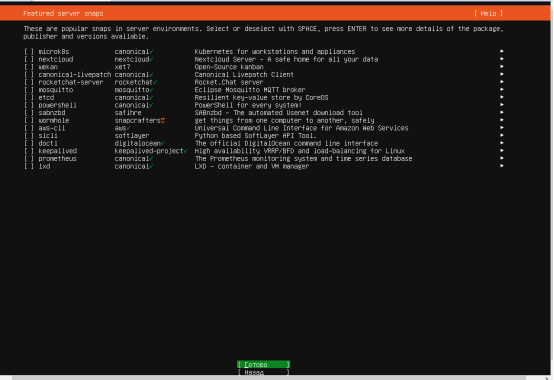

Ожидаем окончание установки

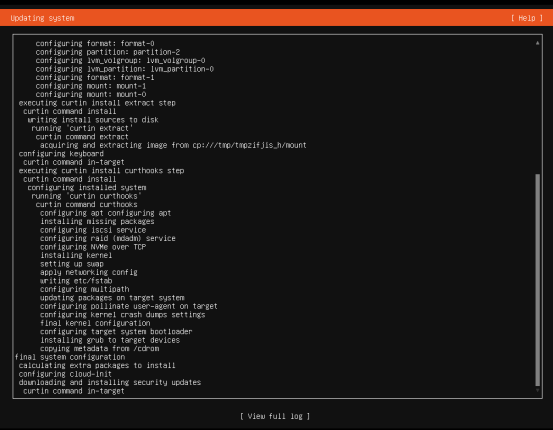

Не ждем обновления, сразу перезапускаем пк

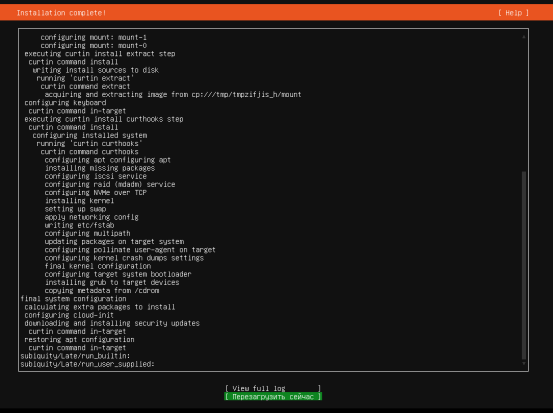

Вводим логин и пароль пользователя

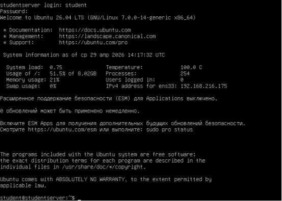

Добавляем пользователя с моей фамилией и настраиваем ему пароль 0000

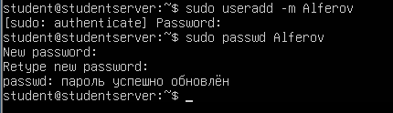

Добавляем пользователя user10 с паролем user10

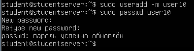

Добавляем пользователей username1-4 и настраиваем им пароль 1234

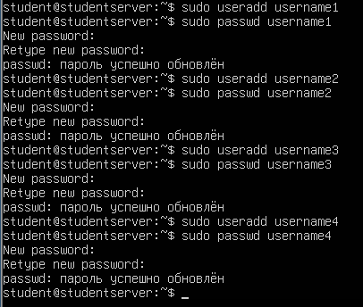

Проверяем что пользователи создались

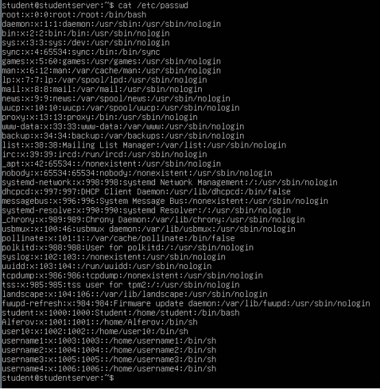

Заходим под каждым из созданых пользователей и выполняем команду whoami

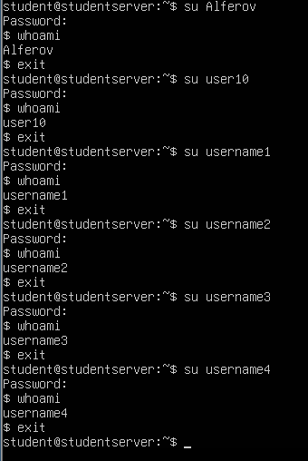
