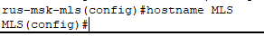
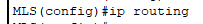
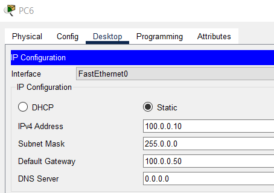
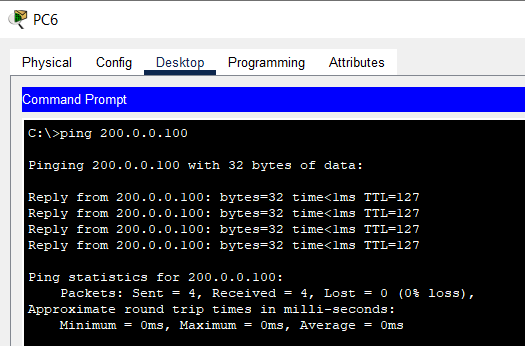

# Часть 3

## Шаг 1: Настройка имени хоста
*Установка имени хоста `MLS` на многоуровневом коммутаторе.*

---

## Шаг 2: Включение маршрутизации
*Активация IP-маршрутизации командой `ip routing`.*

---

## Шаг 3: Создание VLAN
*Создание VLAN 100 с именем Sales_dept и VLAN 200 с именем IT_dept*

---

## Шаг 4: Назначение портов в VLAN
*Настройка интерфейса f0/4 в VLAN 100 и f0/5 в VLAN 200.*

---

## Шаг 5: Настройка SVI между VLAN 100 и 200
*Настройка интерфейса VLAN 100 с IP-адресом 100.0.0.50/8 и VLAN 200 с IP-адресом 200.0.0.50/24.*

---

## Шаг 6: Настройка маршрутизируемых портов
*Преобразование портов f0/1, f0/2, f0/3 в интерфейсы 3-го уровня с IP-адресами 11.0.0.50/8, 12.0.0.50/8, 40.40.40.50/24*

---

## Шаг 7: Проверка связности
*Натсраиваем IP-адрес PC6.*

*Натсраиваем IP-адрес PC7.*

*Выполняем пинг с PC6 на 200.0.0.100*

---
