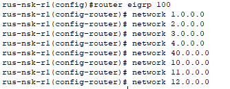
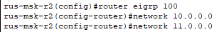
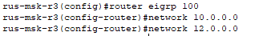
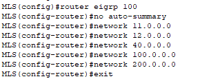
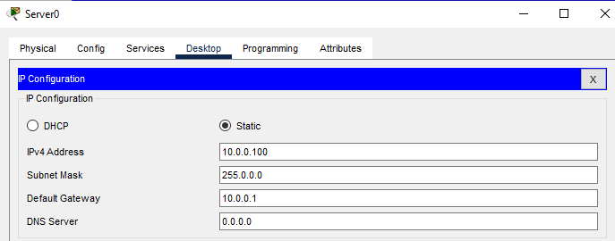
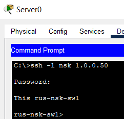
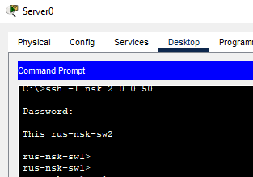
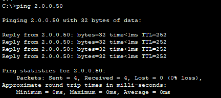

# Часть 5

## Шаг 1: Настройка EIGRP AS 100 на R1, R2, R3, MLS
*Настройка EIGRP на R1.*

*Настройка EIGRP на R2.*

*Настройка EIGRP на R3.*

*Настройка EIGRP на MLS.*

---

## Шаг 2: Проверка SSH-подключения
*Натсраиваем статический адрес серверу в подсети 10.0.0.0/8.*

*Проверка SSH-подключения с Server0 к SW0 с использованием учетных данных 'nsk/cisco'.*

*Проверка SSH-подключения с Server0 к SW1 с использованием учетных данных 'nsk/cisco'.*

---

## Шаг 3: Дополнительная проверка
*Выполнение пинга с Server0 на 2.0.0.50.*

---
