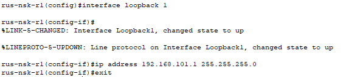
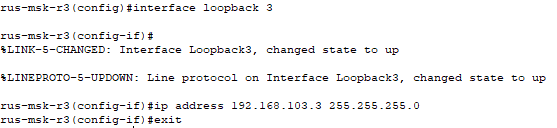
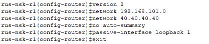
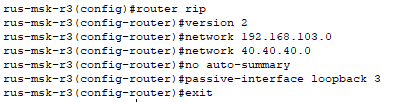
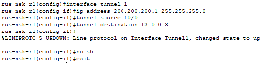
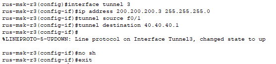
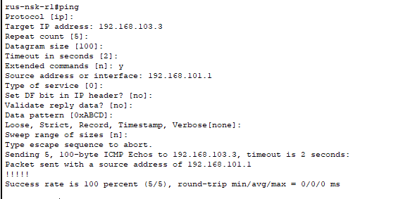
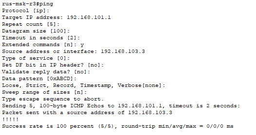

# Часть 7

## Шаг 1: Создание Loopback на R1
*Создание интерфейса Loopback 1 с IP-адресом 192.168.101.1/24.*

---

## Шаг 2: Создание Loopback на R3
*Создание интерфейса Loopback 3 с IP-адресом 192.168.103.3/24.*

---

## Шаг 3: Настройка RIPv2
*Настройка RIP версии 2 на R1.*

*Настройка RIP версии 2 на R3.*

---

## Шаг 4: Настройка GRE-туннеля
*Создание интерфейса Tunnel 1 на R1 с IP-адресом 200.200.200.1/24; Указание порта источника и адреса назначения 12.0.0.3.*

*Создание интерфейса Tunnel 3 на R3 с IP-адресом 200.200.200.3/24; Указание порта источника и адреса назначения 40.40.40.1.*

---

## Шаг 5: Расширенный пинг
*Выполнение расширенного пинга с R1; Указание источника 192.168.101.1 и адреса назначения 192.168.103.3.*

*Выполнение расширенного пинга с R3; Указание источника 192.168.103.3 и адреса назначения 192.168.101.1.*

---
